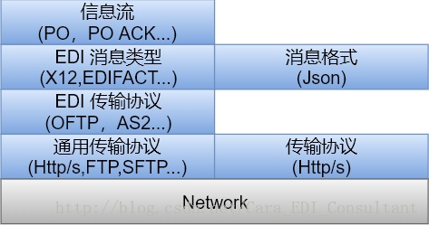
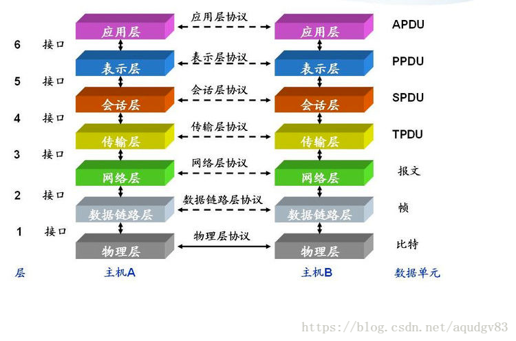

- [API与EDI的区别？](https://blog.csdn.net/Cara_EDI_Consultant/article/details/79363906)

- [知行软件](https://www.kasoftware.com/rssbus-connect-2018.html)
- [EDI的两种解决方案：直连EDI和Web-EDI](https://blog.csdn.net/kasoftware_test/article/details/86524249)
- [EDI传输协议简介](https://blog.csdn.net/WYZSC/article/details/5951188)
- [EDI 传输协议](https://www.kasoftware.com/kb/2014/11/04/edi-protocol.html)
- [TCP/IP协议与Http协议的区别](https://www.cnblogs.com/xianlei/p/tcpip_http.html)
- [https://github.com/OpenAS2/OpenAs2App]()
- 
- 
- 
- 
- 
- 
- 
- 
- 
- 
- 